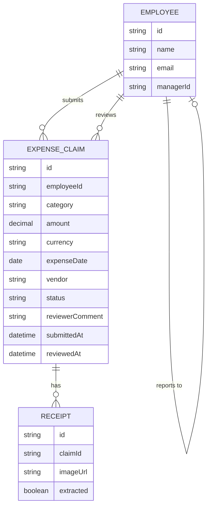

# Domain Model

The expense claim domain centers on the `ExpenseClaim`, submitted by an
Employee and reviewed by their Manager. Each claim carries one or more
receipts, and a receipt's data may be pre-filled by the extraction agent.

- `EMPLOYEE.managerId` is the self-relation a Manager's direct-report queue is
scoped by.
- `EXPENSE_CLAIM.status` is one of `pending`, `approved`, `rejected`. A claim
is editable or withdrawable only while `pending`.
- `EXPENSE_CLAIM.currency` is always `USD` per the Product Decisions.
- `RECEIPT.extracted` records whether the receipt-extraction agent
successfully pre-filled the claim's fields from this receipt's image.

