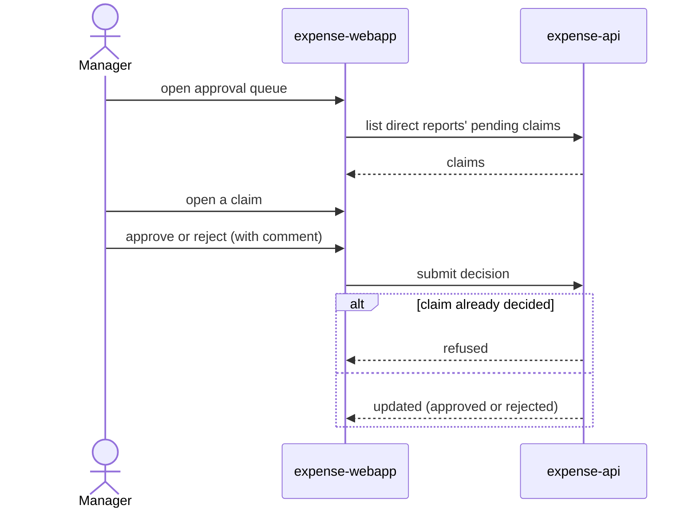

# Approve or reject an expense claim

A Manager reviews the claims their direct reports have submitted and
approves or rejects each one with a comment.

```mermaid
sequenceDiagram
    actor Manager
    participant expense-webapp
    participant expense-api

    Manager->>expense-webapp: open approval queue
    expense-webapp->>expense-api: list direct reports' pending claims
    expense-api-->>expense-webapp: claims
    Manager->>expense-webapp: open a claim
    Manager->>expense-webapp: approve or reject (with comment)
    expense-webapp->>expense-api: submit decision
    alt claim already decided
        expense-api-->>expense-webapp: refused
    else
        expense-api-->>expense-webapp: updated (approved or rejected)
    end
```