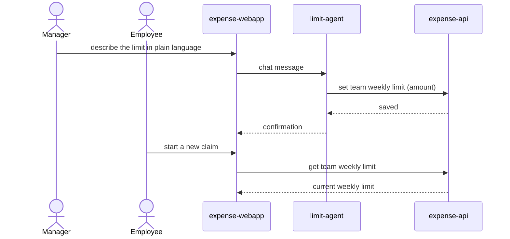

# Set a weekly spending limit

A Manager describes a weekly spending limit for their team in plain language;
an agent parses it and stores it, and Employees see it when they next submit
a claim.

```mermaid
sequenceDiagram
    actor Manager
    actor Employee
    participant expense-webapp
    participant limit-agent
    participant expense-api

    Manager->>expense-webapp: describe the limit in plain language
    expense-webapp->>limit-agent: chat message
    limit-agent->>expense-api: set team weekly limit (amount)
    expense-api-->>limit-agent: saved
    limit-agent-->>expense-webapp: confirmation

    Employee->>expense-webapp: start a new claim
    expense-webapp->>expense-api: get team weekly limit
    expense-api-->>expense-webapp: current weekly limit
```