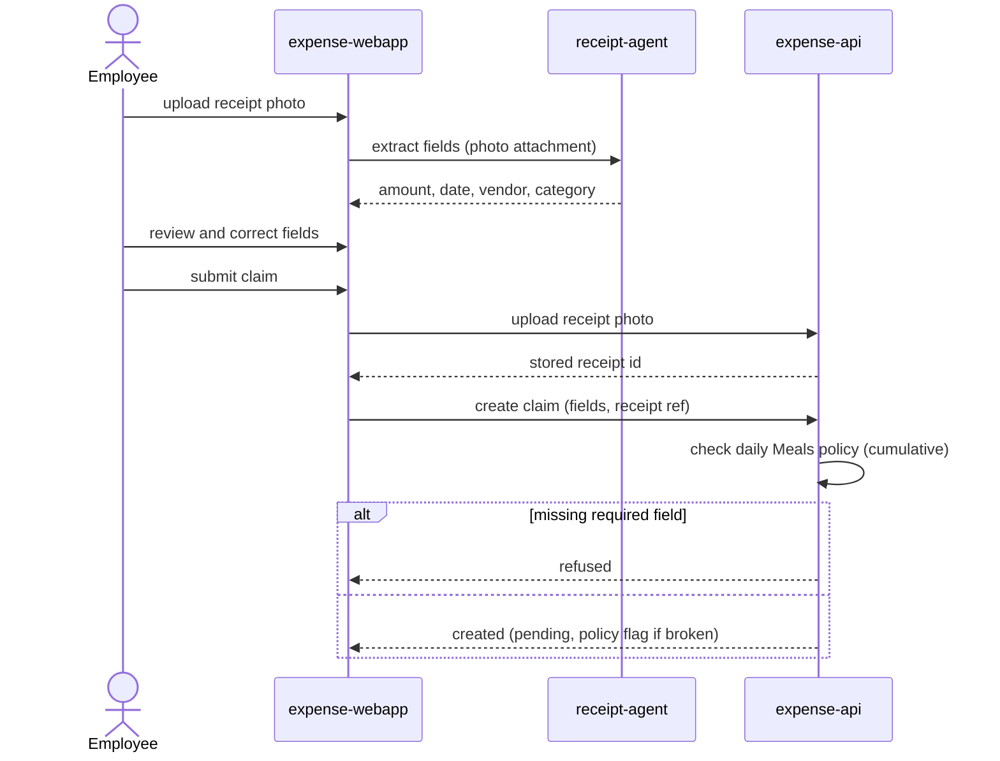

# Submit an expense claim

An Employee photographs a receipt, has its details auto-extracted, reviews
and corrects them, and submits the claim for their manager's approval.

```mermaid
sequenceDiagram
    actor Employee
    participant expense-webapp
    participant receipt-agent
    participant expense-api

    Employee->>expense-webapp: upload receipt photo
    expense-webapp->>receipt-agent: extract fields (photo attachment)
    receipt-agent-->>expense-webapp: amount, date, vendor, category
    Employee->>expense-webapp: review and correct fields
    Employee->>expense-webapp: submit claim
    expense-webapp->>expense-api: upload receipt photo
    expense-api-->>expense-webapp: stored receipt id
    expense-webapp->>expense-api: create claim (fields, receipt ref)
    expense-api->>expense-api: check daily Meals policy (cumulative)
    alt missing required field
        expense-api-->>expense-webapp: refused
    else
        expense-api-->>expense-webapp: created (pending, policy flag if broken)
    end
```